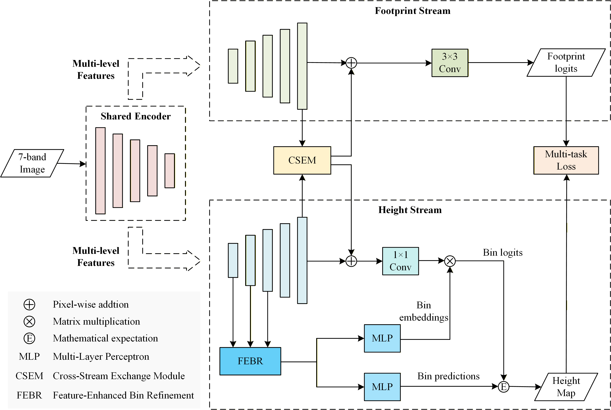

# TSONet

Official PyTorch implementation of **Two-Stream Ordinal Network (TSONet)** for monocular building height estimation from optical remote sensing imagery.

This repository is a **cleaned release version** of the project. Only the **final TSONet pipeline** and the **ablation branches relevant to the paper** are retained.

---

## Overview

TSONet is a two-stream network for building height estimation. It jointly models:

- a **footprint segmentation branch** for building-aware representation learning, and
- a **height estimation branch** for dense building height prediction.

The two branches interact through a **Cross-Stream Exchange Module (CSEM)**, while height estimation is performed with **Feature-Enhanced Bin Refinement (FEBR)**.

<p align="center">
  
</p>
<p align="center">
  <em>Overview of the proposed TSONet framework.</em>
</p>

> Replace `figures/framework.png` with the actual path to your framework figure in this repository.

---

## Main Features

- Clean training and testing pipeline for **TSONet**
- Support for the final **FEBR** head
- Support for a **DETR-style head** as an ablation option
- Support for selected ablations:
  - removing **CSEM**
  - replacing **FEBR** with a **DETR-style head** in BinsFormer
  - removing the footprint branch
  - removing the bin head

---

## Repository Structure

```text
.
├── train.py                   # Training entry
├── test.py                    # Testing / inference entry
├── dataloader/
│   └── PHDataset.py           # Dataset loader
├── models/
│   ├── TSONet.py              # Main model definition
│   ├── encoder.py             # Encoder backbone
│   ├── decoder.py             # Two-stream decoder and CSEM
│   ├── bins_head.py           # FEBR / DETR height heads
│   └── __init__.py            # Model factory
├── options/
│   ├── base_options.py
│   ├── train_options.py
│   └── test_options.py
└── utils/
    ├── losses.py              # Loss functions used by the released TSONet
    ├── metrics.py             # Evaluation metrics
    └── writers.py             # Prediction saving utilities
```

---

## Dataset Preparation

The related dataset, **PHDataset**, is available at:

`https://huggingface.co/datasets/Yanjiao-WHU/PHDataset`

The dataset is organized as follows:

```text
data_root/
├── train/
├── val/
├── test/
└── splits/
    ├── train.txt
    ├── val.txt
    └── test.txt
```

---

## Citation

If you find this repository useful, please cite the corresponding paper.

```bibtex
@misc{tsonet2026,
  title={TSONet: Two-Stream Ordinal Network for Building Height Estimation from Optical Remote Sensing Imagery},
  author={Anonymous},
  year={2026},
  note={Code release accompanying the paper}
}
```
